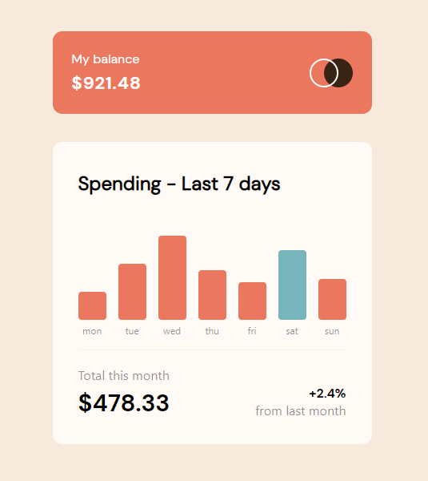

# Frontend Mentor - Expenses chart component solution

This is a solution to the [Expenses chart component challenge on Frontend Mentor](https://www.frontendmentor.io/challenges/expenses-chart-component-e7yJBUdjwt). Frontend Mentor challenges help you improve your coding skills by building realistic projects. 

## Table of contents

- [Overview](#overview)
  - [The challenge](#the-challenge)
  - [Screenshot](#screenshot)
  - [Links](#links)
- [My process](#my-process)
  - [Built with](#built-with)
  - [Useful resources](#useful-resources)
- [Author](#author)

## Overview

### The challenge

Users should be able to:

- View the bar chart and hover over the individual bars to see the correct amounts for each day
- See the current day’s bar highlighted in a different colour to the other bars
- View the optimal layout for the content depending on their device’s screen size
- See hover states for all interactive elements on the page
- **Bonus**: Use the JSON data file provided to dynamically size the bars on the chart

### Screenshot

### Links

- Solution URL: [Github Repo](https://github.com/Tolexia/Expenses-chart-component)
- Live Site URL: [Github Page](https://tolexia.github.io/Expenses-chart-component/)

## My process

### Built with

- Semantic HTML5 markup
- CSS custom properties
- Flexbox
- [React](https://reactjs.org/) - React framework

### Useful resources

- [React Hooks](https://dev.to/ishakmohmed/react-hooks-usecontext-useeffect-usestate-useref-summarized-like-crazy-short-concise-article-254k) - Helped me to handle amount bars sizes on window resize

## Author

- Github - [Tolexia](https://github.com/Tolexia)
- Frontend Mentor - [@Tolexia](https://www.frontendmentor.io/profile/Tolexia)

